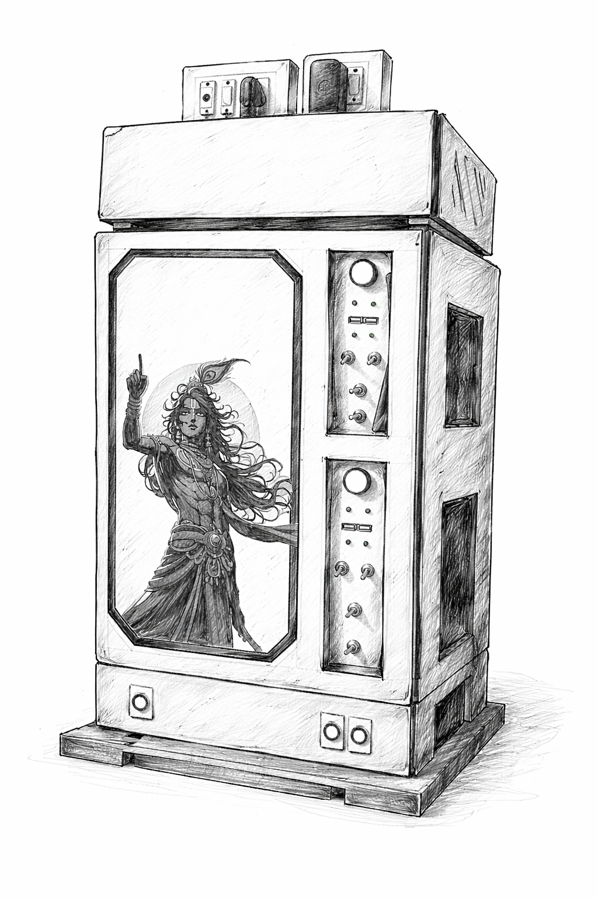
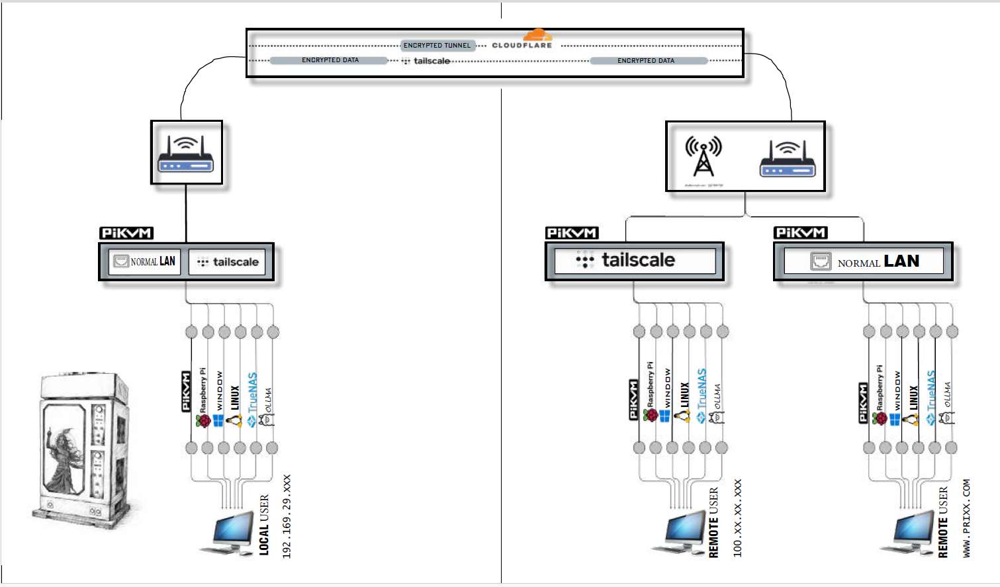

# 🖥️ Remote Control & Multi-OS Power Management System

> **Control should never depend on a single point of failure.**

A Raspberry Pi–based controller that gives you full remote access to high-power machines — without keeping them on 24/7. Switch operating systems, wake machines from anywhere in the world, and always have a hardware fallback if everything else fails.

---

## 🗄️ The Build

<div align="center">



*Hand-built custom control panel — toggle switches, dual power zones, and full hardware override. Built from scratch.*

</div>

This isn't a rack mount or an off-the-shelf solution. Every switch, port, and panel was placed intentionally. The physical build reflects the same philosophy as the software: **layered control, zero single points of failure.**

---

## 🌐 Network Architecture

<div align="center">



</div>

### How Access Works

Three independent paths to your systems — if one fails, the next takes over automatically.

| Layer | Method | Who Uses It |
|---|---|---|
| 🟢 Primary | Normal LAN (`192.168.29.xxx`) | Local user on the same network |
| 🔵 Fallback #1 | Tailscale (`100.xx.xx.xxx`) | Remote user via encrypted mesh VPN |
| 🌍 Fallback #2 | Cloudflare Tunnel (`www.prixx.com`) | Remote user via domain — no port forwarding |

> All three paths run through **PiKVM** — giving you full keyboard, video, and mouse control at the hardware level, regardless of what's happening at the OS layer.

---

## 🔥 What Problems This Actually Solves

---

## 🌍 Remote Access Without Keeping Everything ON

I wanted full remote access to my systems from anywhere in the world — but without running high-power machines 24/7.

| Component | State |
|---|---|
| 🟢 Controller (Raspberry Pi) | Always ON — low power |
| 🔴 Main Systems | OFF / Sleep by default |
| ⚡ On Demand | Power ON → Use → Shutdown |

**Result:**
- 🌐 Personal cloud-like access from anywhere
- ⚡ Massive reduction in electricity usage

---

## 💻 Multi-OS Flexibility — 4 OS Across 2 Systems

Each system is connected to 2 separate drives, controlled via relay switching.

```
2 PCs  ×  2 Drives  =  4 OS Environments
         (Only 2 active at a time → Safe switching)
```

**OS environments running across the systems:**

| Slot | OS |
|---|---|
| 🪟 | Windows |
| 🐧 | Linux |
| 🗄️ | TrueNAS |
| 🤖 | Ollama (local AI) |

**Use Cases:**
- 🧪 Testing environments
- ⚙️ Dev / Daily / Experimental workflows
- 🧱 OS-level isolation — no virtualization overhead

---

## 🌐 Network Redundancy — No Single Point of Failure

```
Primary Access  →  Normal LAN          (192.168.29.xxx)
Fallback #1     →  Tailscale VPN       (100.xx.xx.xxx)
Fallback #2     →  Cloudflare Tunnel   (www.prixx.com)
                         ↓
                      PiKVM
               (Hardware-level KVM access)
```

> If one layer fails, I don't lose control — I just switch the path.

---

## ⚡ Hardware-Level Fail-Safe

Software can crash. Controllers can hang. So I added a hardware-level override — built directly into the panel.

```
DPDT Toggle Switch  →  Direct Manual Control
                    (Works even if Raspberry Pi is completely dead)
```

**Outcome:**
- 🔓 System is never fully locked out
- 🛠️ Physical override always available — no software needed

---

## 🧠 Why This Setup Matters

| Instead of... | You get... |
|---|---|
| ❌ Paying for cloud servers | ✅ Personal server + workstation hybrid |
| ❌ Keeping high-power PCs always ON | ✅ Full hardware-level control |
| ❌ Depending on a single remote method | ✅ Three independent access layers |
| ❌ High operational costs | ✅ Lower electricity & no subscriptions |
| ❌ Software-only control | ✅ Physical toggle override on the panel |

---

## ⚡ In Simple Words

- 🔌 Turn ON my PCs from anywhere in the world
- 🖥️ Use any of 4 operating systems on demand
- 🔄 Switch drives safely with relay control
- 🛡️ Three independent network access paths
- 🔧 Even if everything fails → flip the switch on the panel

---

## 📋 What's Running

- **Raspberry Pi** — always-on controller
- **PiKVM** — hardware-level KVM (keyboard, video, mouse)
- **Tailscale** — encrypted mesh VPN for remote access
- **Cloudflare Tunnel** — public domain access without port forwarding
- **Relay Module** — drive switching between OS environments
- **DPDT Switch** — physical hardware override built into the panel

---

## 📄 License

MIT — feel free to use, adapt, and build on this.

---

<p align="center">
  Built with the philosophy: <strong>always have a fallback.</strong><br><br>
  <em>From the panel switches down to the last network hop.</em>
</p>
